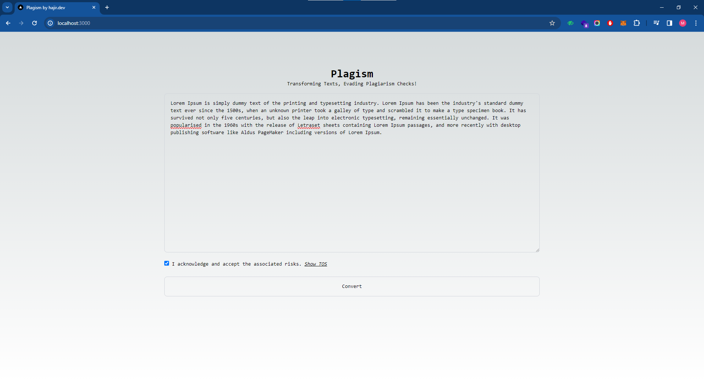
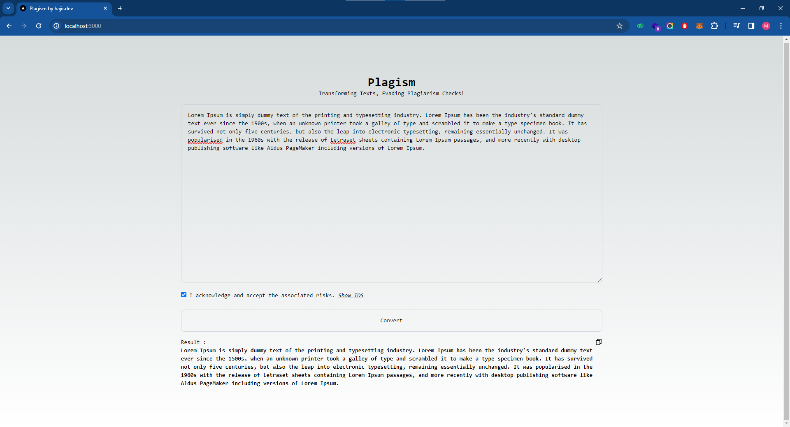

# Plagism 🔍

## How to Run 🏃‍♂️

1. **Clone the Repository**: Clone the repository to your local machine using the following command:
   `git clone https://github.com/hajirr/plagism.git`

2. **Install Dependencies**: Navigate into the cloned directory and install the dependencies using npm:
   `cd plagism` and then
   `npm install`

3. **Comment out Database Saving (Optional)**: If you don't want to use the database saving feature, you can comment out the line `await saveDataToDatabase(text);` in `/api/convert/route.ts`.

4. **Run the Development Server**: Start the development server using the following command:
   `npm run dev`

These steps will set up the project and start the development server. You can then access the tool through your browser and test its functionality.

## Overview ℹ️

Plagism is a project aimed at developing a tool that utilizes homoglyph attack techniques to evade plagiarism detection algorithms while maintaining text readability.

## Motivation 💡

The motivation behind developing Plagism stems from the necessity to address the limitations of traditional plagiarism detection tools. Often, legitimate scholarly work is flagged as plagiarized due to algorithmic detection, leading to erroneous outcomes. Plagism seeks to provide a solution to this problem by employing innovative techniques to circumvent detection while ensuring the integrity of the original text.

## Problem Statement ❗

Plagiarism detection tools, while essential for maintaining academic integrity, can sometimes yield false positives, resulting in legitimate content being flagged as plagiarized. This poses a significant challenge for researchers, academics, and content creators who rely on these tools to ensure the originality of their work.

## Solution 🛠️

Plagism offers a unique approach to addressing the shortcomings of traditional plagiarism detection methods. By leveraging homoglyph attack techniques, the tool alters the appearance of text to evade detection algorithms while retaining its readability and semantic integrity. This enables users to submit their work without the fear of false plagiarism accusations.

## Key Learnings 📚

Throughout the development process of Plagism, several key learnings have emerged:

- Understanding of homoglyph attack techniques and their applications in evading detection systems.
- Insights into the challenges and intricacies of plagiarism detection methods.
- Importance of balancing evasion techniques with maintaining text coherence and readability.

## Standout Features ✨

Plagism stands out from other plagiarism detection tools due to its:

- Innovative use of homoglyph attack techniques to evade detection while preserving text readability.
- Commitment to addressing the limitations of traditional plagiarism detection methods.
- User-friendly interface and seamless integration with existing workflows.

## Screenshots 📷

